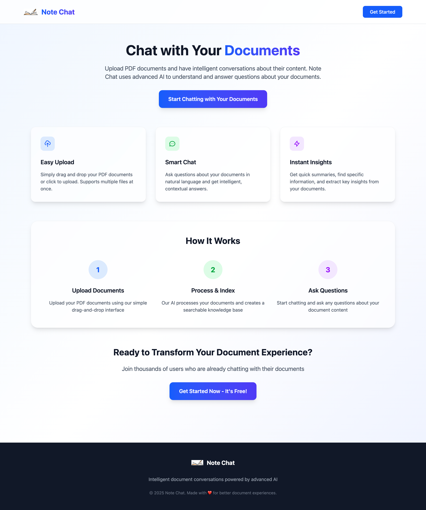
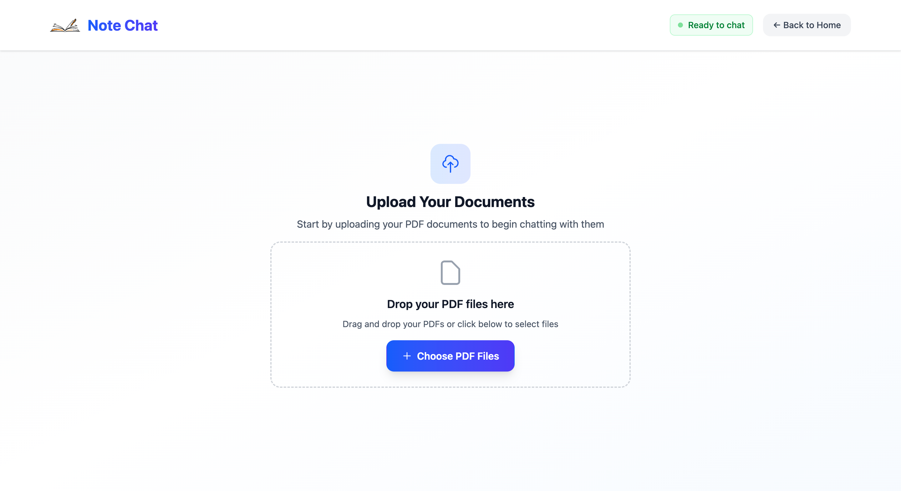
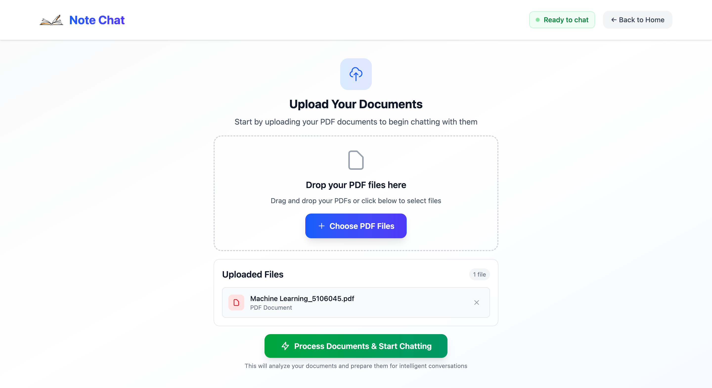
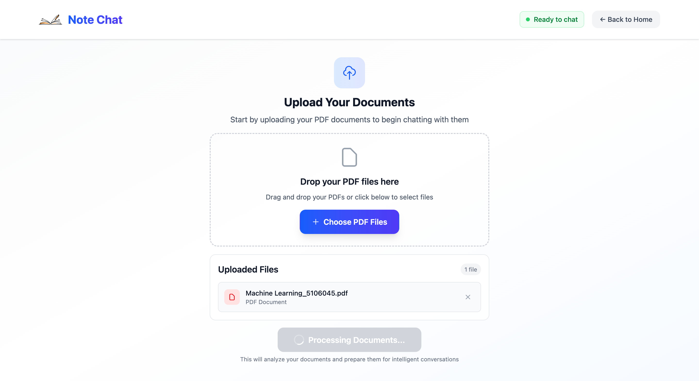
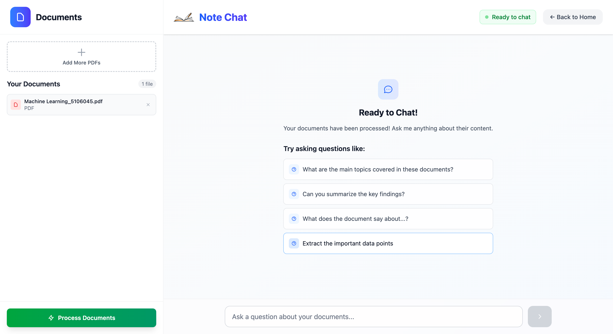
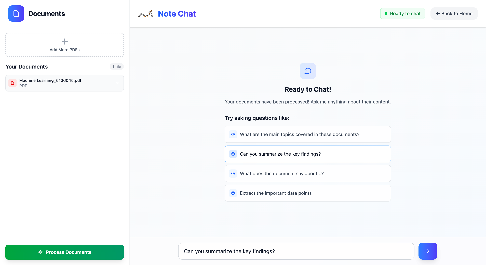
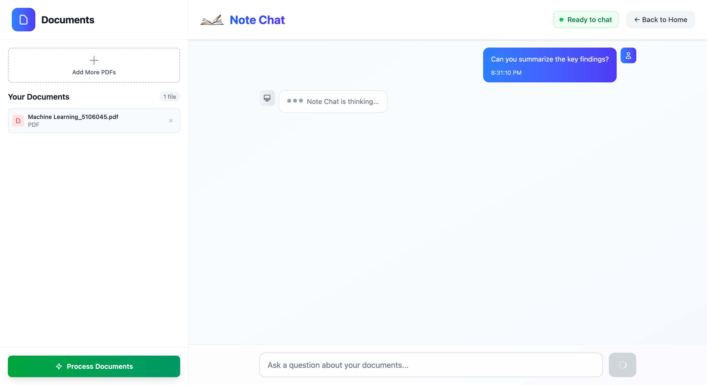
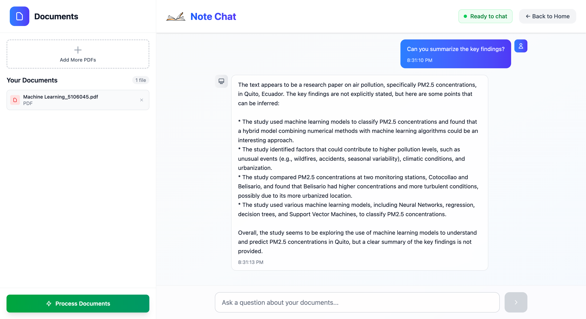

# Note-Chat Application Workflow Documentation

This document provides a detailed visual walkthrough of the Note-Chat application, showing the complete user journey from landing page to document analysis and AI-powered conversation.

## Overview

Note-Chat is an AI-powered document analysis system that allows users to upload PDF documents and have intelligent conversations about their content. The workflow is designed to be intuitive and user-friendly, guiding users through each step seamlessly.

## Complete Visual Workflow

### 1. Welcome & Landing Page

**Description:** The application starts with a clean, professional landing page that introduces users to Note-Chat. This page sets the tone for the application and provides a welcoming entry point for new users.

**Key Features:**
- Clean, modern design
- Clear branding and purpose
- Intuitive navigation to start the document analysis process

---

### 2. Initial Application Interface

**Description:** Upon entering the main application, users are presented with a clean interface that's ready for document upload. The layout is organized with clear sections for different functionalities.

**Key Features:**
- Sidebar for navigation and file management
- Central area prepared for document upload
- Header with application branding
- Responsive design elements

---

### 3. Document Upload Interface

**Description:** The file upload interface provides a user-friendly drag-and-drop area where users can easily upload their PDF documents. The interface clearly indicates where files should be dropped and what file types are accepted.

**Key Features:**
- Drag-and-drop upload area
- File type validation (PDF only)
- Visual feedback for upload zones
- Clear instructions for users

---

### 4. Document Processing Phase

**Description:** Once documents are uploaded, the system begins processing them. This involves text extraction, chunking, and creating vector embeddings for semantic search capabilities.

**Key Features:**
- Processing indicators
- Real-time feedback to users
- Status updates during processing
- Error handling for failed uploads

---

### 5. Chat Interface Activation

**Description:** After successful document processing, the chat interface becomes active. Users can now see that the system is ready to answer questions about their uploaded documents.

**Key Features:**
- Active chat input area
- Visual confirmation of successful processing
- Ready state indicators
- Accessible chat functionality

---

### 6. User Query Input

**Description:** Users can now type questions about their documents. The interface provides a natural chat experience where users can ask complex questions about the content of their uploaded PDFs.

**Key Features:**
- Natural language query input
- Chat message formatting
- User-friendly input controls
- Real-time message display

---

### 7. AI-Powered Response Generation

**Description:** The system generates intelligent responses based on the document content. The AI analyzes the uploaded documents and provides relevant, contextual answers to user questions.

**Key Features:**
- AI-generated responses based on document content
- Contextual understanding
- Formatted response display
- Source document referencing

---

### 8. Continued Conversation Flow

**Description:** Users can continue the conversation, asking follow-up questions or exploring different aspects of their documents. The system maintains context throughout the conversation.

**Key Features:**
- Conversation history maintenance
- Contextual follow-up responses
- Multi-turn conversation support
- Persistent chat state

---

## Technical Workflow Behind the Scenes

### Document Processing Pipeline
1. **File Upload**: PDFs are received via the FastAPI backend
2. **Text Extraction**: Content is extracted from PDF files
3. **Text Chunking**: Documents are split into semantic chunks
4. **Vectorization**: Text chunks are converted to embeddings
5. **Storage**: Vectors are stored in FAISS for similarity search

### Question Answering Process
1. **Query Processing**: User questions are analyzed and vectorized
2. **Similarity Search**: Relevant document chunks are retrieved
3. **Context Building**: Retrieved chunks provide context for the LLM
4. **Response Generation**: AI generates answers based on document content
5. **History Tracking**: Conversation context is maintained

## User Experience Design Principles

### Simplicity
- Clean, uncluttered interface
- Intuitive navigation flow
- Clear visual hierarchy

### Accessibility
- Responsive design for all devices
- Clear visual feedback for all actions
- Error messages and help text

### Performance
- Fast document processing
- Real-time chat responses
- Efficient file handling

### Reliability
- Comprehensive error handling
- Graceful degradation
- Consistent user experience

## Supported Features Demonstrated

### File Management
- Multiple PDF upload support
- File validation and error handling
- Progress indicators during upload

### AI Conversation
- Natural language processing
- Context-aware responses
- Multi-turn conversation support
- Document-based answer generation

### User Interface
- Modern React-based frontend
- Responsive design with Tailwind CSS
- Real-time updates and feedback
- Professional styling and branding

---

*This workflow documentation demonstrates the complete user journey through the Note-Chat application, from initial landing to advanced document analysis and AI-powered conversation.*
